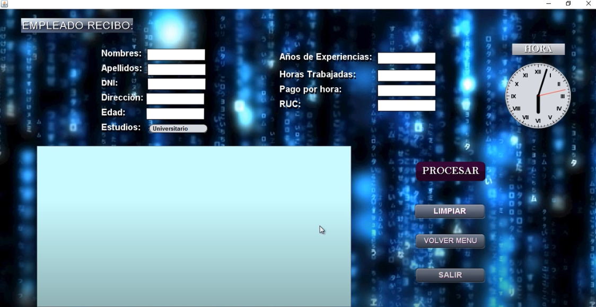

 

# Sistema-de-Empleados-Employees-system
En este proyecto es un sistema de reporte de empleados, donde podemos ingresar los datos de empleado planilla o contratados, como es en el caso de estudios, afp ,pago por horas, etc, realizado en java (Netbeans).

# Componentes principales
### Login
Donde los usuarios registrados pueden iniciar sesion.
 

### Empleados Recibo
Donde podemos revisar el recibo de sueldo de un empleado determinado.
 

### Planilla de empleado
Donde podemos revisar la planilla de un determinado empleado.
 

### NOTA IMPORTANTE: en la carpeta PROYECTO FINAL se encuentra toda la programción de Sistema de Empleados
